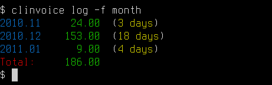
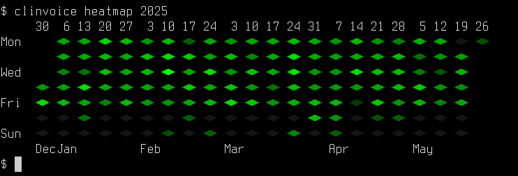
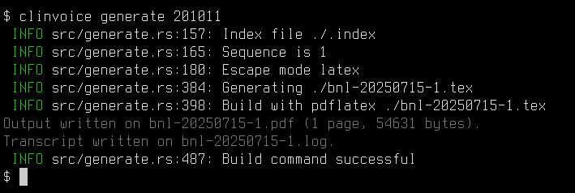

# clinvoice-rs

## About

`clinvoice-rs` is a command-line tool for generating invoices from timesheet data. It reads `.cli` files, which contain time entries, and uses a Tera template to generate an invoice. The tool is configured using a `clinvoice.toml` file, which allows you to specify your invoice template, tax rate, and other settings. This allows for a high degree of customization and automation in your invoicing workflow.

This is an oxidized 🦀 version of [clinvoice-zsh](https://github.com/bartman/clinvoice-zsh), which I was previously using for about 15 years to generate invoices from text timesheets.
I tried to stick to the original version so that my old timesheets were still legible, but the template and configuration files are not compatible.

## Timesheets

Timesheet data is stored in `.cli` files. These files have a simple format, with each line representing either a date or a time entry.

### Time Entries

Time entries specify hours worked and a description.

```
2025.07.01
  8h = Project A
  9-12 = Project B
```

You can also specify negative hours for discounts:

```
2025.07.13
  -2h = Discount for early payment
```

### Fixed Cost Entries

Fixed cost entries allow you to add or subtract fixed amounts to the invoice.

```
2025.07.13
  $100 = Some fixed cost
  -$50 = Discount for something else
```

### Notes

Lines starting with `*` or `-` are treated as notes and are ignored in calculations but can be included in templates.

```
2025.07.13
  * This is a note about the work done today.
  - Another note.
```

### Comments

Lines starting with `#` or `//` (with optional leading whitespace) are treated as full-line comments and are ignored by the parser. This is useful for adding notes to your timesheet files that you don't want to appear on the invoice.

```
# This is a full-line comment and will be ignored.
  // This is also a comment and will be ignored.

2025.07.13
  8h = Project A # This is NOT a comment and will be part of the description.
```

## Configuration

It expected that you have a directory of `.cli` files for each client, along with a `clinvoice.toml` configuration file, and a template used to generate the output.

An directory of example files is provided to illustrate the setup:

```sh
❯ lt examples
 examples
├──   2010-11.cli
├──   2010-12.cli
├──   2011-01.cli
├──   bnl-template.tex
├──   bnl-template.txt
└──   clinvoice.toml
```

## Logs

You can view your time entries using the `log` command. This command can display logs in different formats:

*   `full`: Shows all individual time entries.
*   `day`: Aggregates entries by day.
*   `month`: Aggregates entries by month.
*   `year`: Aggregates entries by year.

Example:

```bash
clinvoice log --format year
clinvoice log --format month 2025
clinvoice log --format day 2025.07
clinvoice log --format full 2025.07.01
```



## Heatmap

You can also visualize your time entries as a heatmap using the `heatmap` command. This command displays a grid of colored squares, where the intensity of the color corresponds to the amount of work done on a given day.

Example:

```bash
clinvoice heatmap 2025
```



## Templates

Invoices are generated using Tera templates. Here is a simple example of a template:

```latex
\documentclass{article}

\begin{document}

Invoice for {{ period_start | date(format="%B %d, %Y") }} - {{ period_end | date(format="%B %d, %Y") }}

\begin{tabular}{lrr}
Date & Hours & Description \\
\hline

{{ day.date | date(format="%Y-%m-%d") }} & {{ day.hours }} & {{ day.description }} \\

\end{tabular}

Total: {{ total_amount }}

\end{document}
```

This template will generate a simple LaTeX invoice with a table of time entries.

The configuration can point to multiple generators, using multiple template
files. One of the generators can be made default. If the configuration sets up
a `build` command for this latex file, you have it automatically generate a PDF
using `pdflatex`.

For example:

```toml
[generator]
    default     = "pdf"
[generator.txt]
    template    = "template.txt"
    output      = "output-{{sequence}}.txt"
[generator.pdf]
    template    = "template.txt"
    output      = "output-{{sequence}}.tex"
    build       = "pdflatex {{output}}"
```

## Generating PDF

A silly example is provided in the examples directory.

```sh
clinvoice generate 201011
clinvoice generate 201012
clinvoice generate 201101
```




## Variables

The following variables are available in your templates:

### Global Variables

*   `now`: The current date and time in RFC 3339 format.
*   `today`: The current date in `YYYY-MM-DD` format.
*   `invoice_date`: The date of the invoice (same as `today`).
*   `due_date`: The invoice due date, calculated based on the `contract.payment-days` in your configuration.
*   `period_start`: The first date in the selected time data.
*   `period_end`: The last date in the selected time data.
*   `subtotal_amount`: The total cost of all time entries before tax.
*   `tax_amount`: The calculated tax amount.
*   `total_amount`: The total amount of the invoice (subtotal + tax).

Advanced

* `total_fixed_fees` is a tally of fixed fees (included in `subtotal_amount`)
* `total_discounts` is a tally of discounts (included in `subtotal_amount`)
* `total_hours_worked` is number of hours in spreadsheet
* `total_hours_counted` is number of hours after `contract.cap_hours_per_day` limit is applied
* `total_hours_billed` is number of hours capped to `contract.cap_hours_per_invoice`
* `overage_hours` is number of hours counted, but not billed
* `counted_amount` is `rate * total_hours_counted`
* `billed_amount` is `rate * total_hours_billed` (included in `subtotal_amount`)

### Day Variables

These variables are available within the `` loop:

*   `day.index`: The index of the day in the list of entries.
*   `day.date`: The date of the entry in `YYYY-MM-DD` format.
*   `day.hours`: The total hours for the day.
*   `day.cost`: The cost for the day (hours * rate).
*   `day.description`: A semicolon-separated list of descriptions for the day's entries.

### Filters

*   `date(format="%Y-%m-%d")`: Formats a date string using `strftime` syntax.
*   `left(width=N)`: Left-justifies a string within the given width, truncating if necessary.
*   `right(width=N)`: Right-justifies a string within the given width, truncating if necessary.
*   `center(width=N)`: Centers a string within the given width, truncating if necessary.
*   `decimal(precision=N)`: Formats a floating-point number to the specified number of decimal places, including trailing zeros.

